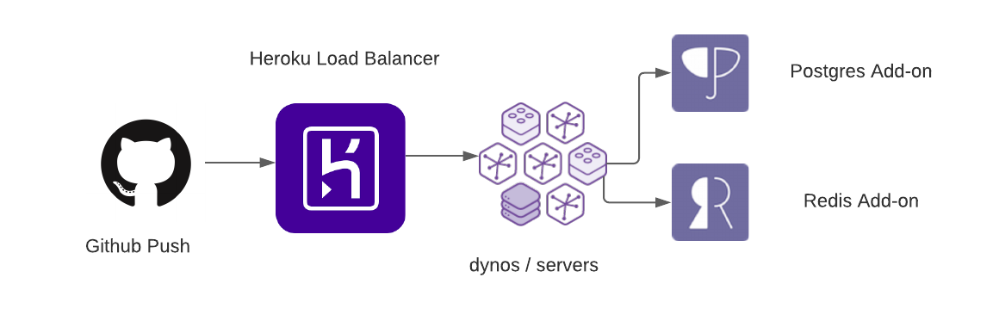
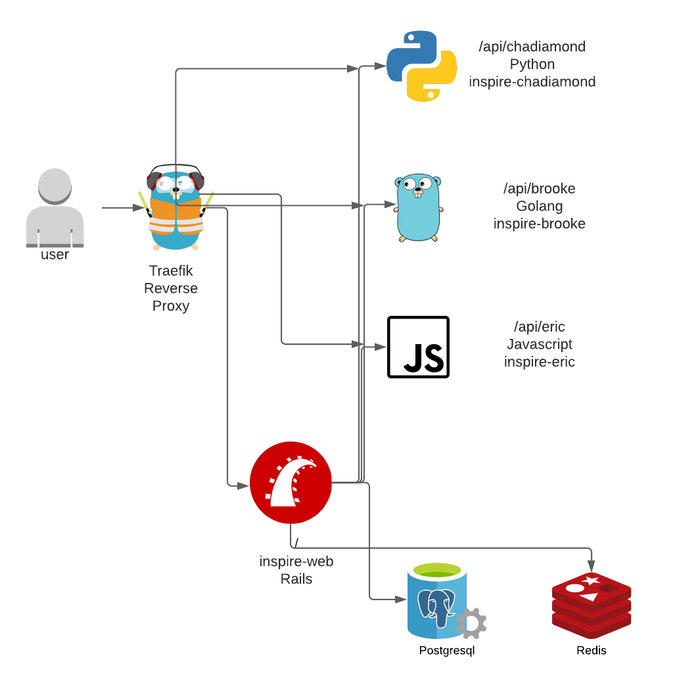

</img>

# Lightyear SRE Challenge

> "Site reliability engineering is a discipline that incorporates aspects of software engineering and applies them to infrastructure and operations problems."

## Introduction
Hello and welcome! If you are reading this, then you have chosen to give our SRE Code Challenge a try. Splendid! You've got this.

Software Engineering interviewing is something our industry has never real done well. We've tried to find the right blend of respecting your time and ensuring you will be  successful in our organization as an SRE.

This challenge will give you a taste of the kind of real work an SRE on our team performs. A mix between coding, networking, infrastructure, and observability.

## Background
The team built a web application that is designed to provide inspirational quotes from team members. It's been a wild success! So much so that the traffic started to exceed our compute capabilities in Heroku.

The old architecture:

</img>

After a major outage, the team identified that the API returning quotes was being consumed by an internal mobile application. That unexpected traffic was taking the website down.

To handle this increase we are going to move the APIs to micro-services, in order to do this and still support the mobile app we will use the reverse proxy Traefik to ensure that /api/chadiamond, /api/eric, and /api/brooke are still valid.

The new architecture:

</img>
